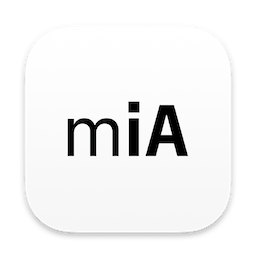

## Logseq miA theme

**miA** is a [Logseq](https://github.com/logseq/logseq) theme family inspired by the styling and typography used by [macOS](https://www.apple.com/macos/monterey/) and [iA Writer](https://ia.net/writer). All of the **miA** themes share a common aesthetic and support light and dark mode (based on the selection in Logseq's *Settings*). Priority is placed on providing a clean editing and reading experience in a familiar, productive environment.


| Theme name | Font | Purpose |
|---|---|---|
| miA Mono | iA Writer Mono | When you want to work with a monospace font, focusing on content not presentation. |
| miA Duo | iA Writer Duo | Like a monospace font, but without the compromises imposed on wider letters. |
| miA Quattro | iA Writer Quattro | More like a proportional font than Duo, with some narrower letters. Good for small screens. |
| miA Sans | IBM Plex Sans | When you want to see your work in a modern sans serif format. Good for reading. |
| miA Serif | IBM Plex Serif | When you want to see your work in a classic serif format. Good for reading. |

## Installation

**miA** is available on the Logseq marketplace. To see the marketplace, choose *Plugins* from Logseq's main menu. Once **miA** is installed, choose *Themes* from the main menu, then select the desired theme variation.

If you don’t see Plugins on the main menu, you will need to enable plug-ins: go to Logseq *Settings* from the main menu, then the *Advanced* section, and enable the Plug-in system. You will then need to restart Logseq.

If you don’t want to use the marketplace, you can add **one** of the following lines to the start of your Logseq `custom.css` file (you can access this file from *Settings*).

``` css
@import url('https://playerofgames.github.io/logseq-mia-theme/mia_mono.css');
@import url('https://playerofgames.github.io/logseq-mia-theme/mia_duo.css');
@import url('https://playerofgames.github.io/logseq-mia-theme/mia_quattro.css');
@import url('https://playerofgames.github.io/logseq-mia-theme/mia_sans.css');
@import url('https://playerofgames.github.io/logseq-mia-theme/mia_serif.css');
```

## Customising the themes

The themes use **CSS variables** to control various aspects of presentation, and may therefore serve as a good foundation for user-specified typography choices. The following variables are available, and their purpose is mostly self-explanatory. Values specified by the *miA Serif* theme are shown as an exemplar.

| Variable name | Default value | Value for *miA Serif* |
|---|---|---|
| --content-font-family | (not set—theme-specific) | "IBM Plex Serif" |
| --content-font-size | 100% (12pt) | 13.5pt |
| --content-line-height | inherit (18pt) | 22pt |
| --content-font-stylistic-set | (not set—see note 1) | |
| --title-font-family | (system font—see note 2) | "IBM Plex Serif" |
| --title-font-size | 20pt | 18pt |
| --title-font-breadcrumb-size | (same as content font size) | 13.5pt |
| --title-font-stylistic-set | (not set—see note 1) | |
| --block-padding | 2px | 5px |
| --content-h1-text-decoration | underline | none |
| --content-h1-size | 110% | 123% |
| --content-h1-font-weight | **bold** | |
| --content-h1-font-style | normal | |
| --content-h2-size | 110% | 115% |
| --content-h2-font-weight | **bold** | |
| --content-h2-font-style | normal | |
| --content-h3-size | 110% | 100% |
| --content-h3-font-weight | normal | **bold** |
| --content-h3-font-style | *italic* | normal |
| --content-h4-size | 100% | |
| --content-h4-font-weight | **bold** | **bold** |
| --content-h4-font-style | normal | *italic* |
| --content-h5-size | 100% | |
| --content-h5-font-weight | normal | |
| --content-h5-font-style | *italic* | |
| --content-h6-size | 100% | |
| --content-h6-font-weight | normal | |
| --content-h6-font-style | normal | |
| --table-border-color | (same as bullet colour) | |
| --table-font-size | 100% | |
| --table-heading-font-size | 90% | 75% |
| --table-heading-transform | none | uppercase |

**Notes**

1. Font feature settings may be used to specify, for example, non-slashed zeros (as in *miA Quattro*).

2. The title font applies to page titles and breadcrumbs (the path shown at the top of pages and in references).

## Tips and tricks

### Journal entries

There are two ways to view a Journal entry: from the *Journals* view where you can scroll through the different days, and the page view, where you see just the single day, plus its references. It can be useful to distinguish the two views. One way is by changing how the title is presented when in the journal view. For example, this CSS makes the journal titles italic and normal weight, giving journaling a more informal feel:

``` css
a.journal-title > h1.title {
	font-weight: 300;
	font-style: italic;
}
```

### Matching title font for **miA Quattro**
For the Mono, Duo and Quattro themes, the System default font is used for page titles and breadcrumbs. However, the *iA Writer Quattro* font is [almost] a proportional font and is sufficiently compact to use for titles and breadcrumbs. If you use **miA Quattro**, add the following to `custom.css` to change titles and breadcrumbs to match:

``` css
:root {
	--title-font-family: "iA Writer Quattro S";
	--title-font-size: 18pt;
	--title-font-stylistic-set: "ss04"; /* plain (not dotted) zeros */
}
```

(If you aren't using **miA Quattro**, you'll have to install the *iA Writer Quattro* font first.)

## Credits

["iA Writer" fonts](https://ia.net/topics/a-typographic-christmas): Copyright © 2018 Information Architects Inc. with Reserved Font Name "iA Writer". Licensed under the SIL Open Font License 1.1.

[IBM "Plex" fonts](https://www.ibm.com/plex/): Copyright © 2017 IBM Corp. with Reserved Font Name "Plex". Licensed under the SIL Open Font License 1.1.

[rcvd](https://github.com/rcvd) for their Logseq Quattro theme, from which I took inspiration to make the first **miA** theme.

## Licence

Licensed under the MIT License.





